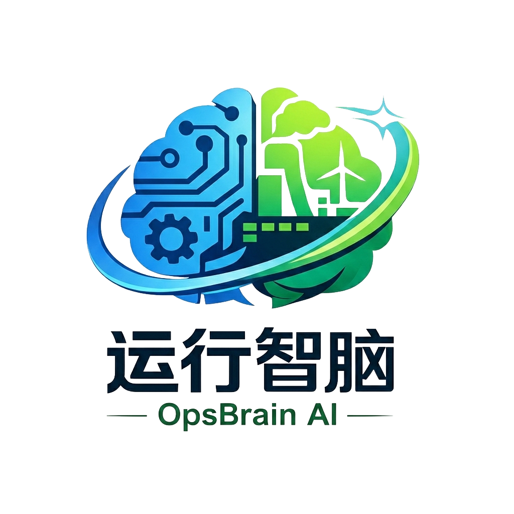

# 运行智脑 OpsBrain AI

<p align="center">
  
</p>

<p align="center">
  <strong>智能运维管理平台</strong><br/>
  AI 驱动的运维管理系统，实现智能监控、自动化运维、数据驱动决策与绿色节能管理
</p>

---

## 技术架构

本项目采用前后端分离架构：

| 层级 | 技术栈 |
|------|--------|
| **前端** | Vue 3 · TypeScript · Vite · Vue Router · Pinia · Axios · Naive UI · Less |
| **后端** | Python 3.13+ · FastAPI · SQLAlchemy 2 (async) · PostgreSQL · Pydantic |
| **认证** | JWT (HS256) · bcrypt 密码哈希 |

## 项目结构

```
operation_brain_ai/
├── backend/                    # 后端服务
│   ├── main.py                 # FastAPI 应用入口
│   ├── pyproject.toml          # Python 依赖配置
│   ├── uv.lock                 # uv 依赖锁定文件
│   ├── core/
│   │   ├── settings.py         # 环境配置（多环境支持）
│   │   └── security.py         # JWT & 密码加密
│   ├── db/
│   │   ├── session.py          # 异步数据库引擎 & Session
│   │   └── models/
│   │       ├── __init__.py
│   │       └── user.py         # 用户 & 角色模型
│   ├── router/
│   │   └── users_router.py     # 用户路由
│   ├── schema/
│   │   └── user_schema.py      # 请求/响应 Schema
│   ├── .env.current            # 当前环境标识
│   ├── .env.dev                # 开发环境配置
│   └── .env.prod               # 生产环境配置
│
├── frontend/                   # 前端应用
│   ├── index.html              # HTML 入口
│   ├── package.json            # Node 依赖配置
│   ├── vite.config.ts          # Vite 构建配置
│   ├── tsconfig.json           # TypeScript 配置
│   ├── public/
│   │   └── favicon.png         # 网站图标
│   └── src/
│       ├── main.ts             # 应用入口
│       ├── App.vue             # 根组件（Naive UI 主题配置）
│       ├── api/
│       │   └── auth.ts         # 认证接口封装
│       ├── router/
│       │   └── index.ts        # 路由配置
│       ├── stores/
│       │   ├── index.ts        # Pinia 初始化
│       │   └── user.ts         # 用户状态管理
│       ├── styles/
│       │   ├── variables.less  # 主题变量（蓝/绿双色）
│       │   └── global.less     # 全局样式
│       ├── utils/
│       │   └── request.ts      # Axios 实例 & 拦截器
│       └── views/
│           ├── Login.vue       # 登录页
│           └── Register.vue    # 注册页
│
└── readme.md
```

## 快速开始

### 环境要求

- **Python** >= 3.13
- **Node.js** >= 18
- **PostgreSQL** >= 14
- **uv**（Python 包管理器，推荐）

### 1. 数据库准备

创建 PostgreSQL 数据库：

```sql
CREATE DATABASE operation_brain;
```

### 2. 后端启动

```bash
cd backend

# 配置环境变量
# 编辑 .env.current 设置 ENV=dev
# 编辑 .env.dev 填入数据库连接信息：
#   POSTGRES_HOST=localhost
#   POSTGRES_PORT=5432
#   POSTGRES_USER=your_user
#   POSTGRES_PASSWORD=your_password
#   POSTGRES_DB=operation_brain

# 安装依赖
uv sync

# 启动开发服务器
uvicorn main:app --reload --host 0.0.0.0 --port 8000
```

后端服务运行在 `http://localhost:8000`，API 文档访问 `http://localhost:8000/docs`

### 3. 前端启动

```bash
cd frontend

# 安装依赖
npm install

# 启动开发服务器
npm run dev
```

前端服务运行在 `http://localhost:3000`，开发模式下 `/api` 请求自动代理到后端 `8000` 端口。

### 4. 构建生产版本

```bash
cd frontend
npm run build
```

构建产物输出到 `frontend/dist` 目录。

## 主题色

从项目 Logo 提取的双主题色方案：

| 色彩 | 色值 | 用途 |
|------|------|------|
| 🔵 科技蓝 | `#2196F3` | 主色调，按钮、链接、主要交互元素 |
| 🟢 生态绿 | `#4CAF50` | 辅助色，强调、渐变、成功状态 |

页面按钮与品牌区域采用蓝绿渐变 `linear-gradient(135deg, #2196F3, #4CAF50)`。

## 后端架构说明

- **多环境配置**：通过 `.env.current` 中的 `ENV` 字段切换 `dev` / `prod` 环境，自动加载对应 `.env.{ENV}` 文件
- **异步数据库**：基于 `asyncpg` 驱动 + SQLAlchemy 2 异步引擎，配置连接池参数优化性能
- **自动建表**：应用启动时通过 `lifespan` 事件自动执行 `create_all`
- **统一基类**：`BaseModel` 提供 `id`（UUID）、`created_at`、`updated_at`、`is_deleted` 通用字段
- **安全模块**：bcrypt 密码加密、JWT Token 签发与验证

## 前端架构说明

- **组件库**：Naive UI，已配置中文国际化与主题色覆盖
- **状态管理**：Pinia，用户 Token 持久化到 localStorage
- **HTTP 封装**：Axios 实例统一处理 Token 注入、401 自动跳转登录
- **样式方案**：Less 预处理器，全局变量注入，支持响应式布局
- **路由守卫**：`beforeEach` 自动设置页面标题

## 开发脚本

| 命令 | 说明 |
|------|------|
| `cd frontend && npm run dev` | 启动前端开发服务器 |
| `cd frontend && npm run build` | 构建前端生产版本 |
| `cd frontend && npm run preview` | 预览构建产物 |
| `cd backend && uvicorn main:app --reload` | 启动后端开发服务器 |

## License

MIT
